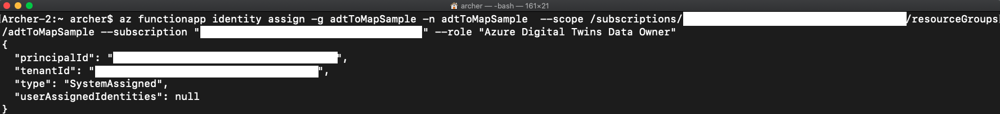
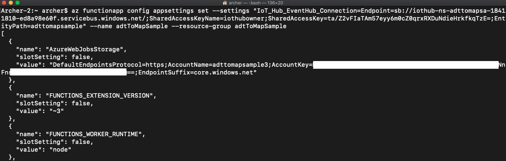
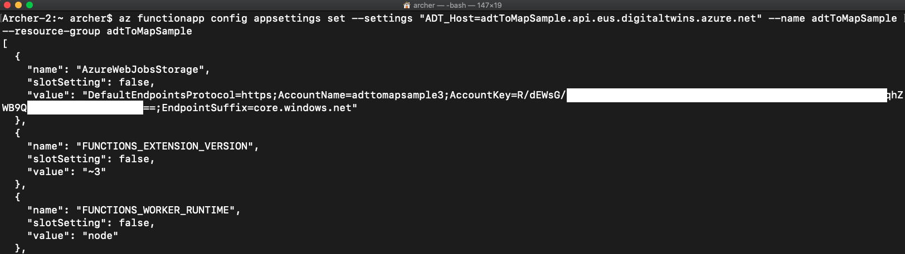
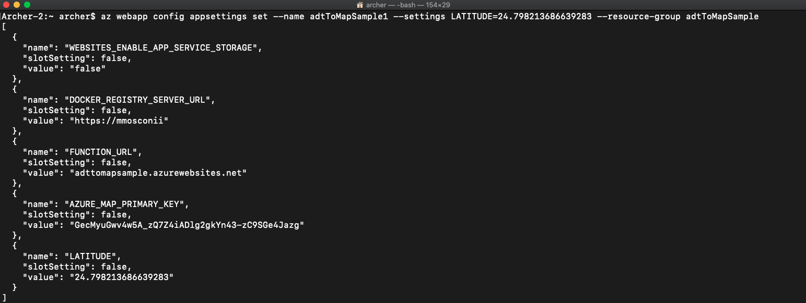
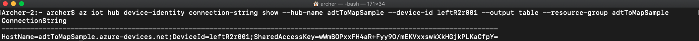

# Contents
- [Prerequisites](#prerequisites)
- [Steps](#steps)
  - [1. Download project from GitHub](#1-download-project-from-github)
  - [2. Sign in](#2-sign-in)
  - [3. Create a resource group](#3-create-a-resource-group)
  - [4. Use Creator to create indoor maps](#4-use-creator-to-create-indoor-maps)
  - [5. Create Azure Digital Twin & Initial Property](#5-create-azure-digital-twin--initial-property)
  - [6. Create Azure IoT Hub and Create IoT Device](#6-create-azure-iot-hub-and-create-iot-device)
  - [7. Create & Deploy Azure Function](#7-create--deploy-azure-function)
  - [8. Set Endpoint & Event Routes](#8-set-endpoint--event-routes)
  - [9. Frontend : Azure Map + Azure Digital Twin](#9-frontend--azure-map--azure-digital-twin)
  - [10. Start Device](#10-start-device)
  - [11. Device & Dashboard](#11-device--dashboard)

# Prerequisites
|      Category     |                                                      Item                                                      |
|:-----------------:|:--------------------------------------------------------------------------------------------------------------:|
|       Cloud       |                                 [ Azure account ]( https://portal.azure.com/ )                                 |
| IDE               | [ Visual Studio Code ]( https://code.visualstudio.com/ )                                                       |
| CLI               | [ Azure CLI ]( https://docs.microsoft.com/zh-tw/cli/azure/install-azure-cli )                                  |
| API Client        | [ Postman ]( https://www.postman.com/ )                                                                        |
| Drawing package   | [ AutoCAD ]( https://www.autodesk.com.tw/products/autocad/overview?term=1-YEAR )                               |
| VS Code Extension | [ Azure Functions ]( https://marketplace.visualstudio.com/items?itemName=ms-azuretools.vscode-azurefunctions ) |

# Steps
## 1. Download project from GitHub
* https://github.com/ArcherHuang/Examples-of-Azure-Digital-Twins/tree/CMS

## 2. Sign in
* Sign in with Azure CLI
  ```
  az login
  ```

## 3. Create a resource group
* Create a group
  ```
  az group create --name <ResourceGroup> --location eastus
  ```

  

## 4. Use Creator to create indoor maps
* Create Auzre Maps Accounts
  ```
  az maps account create --kind Gen2 --account-name <MapAccount> --resource-group <ResourceGroup> --sku G2
  ```

  

* Create Creator
  ```
  az maps creator create --location eastus2 --storage-units 1 --account-name <MapAccount> --creator-name <CreatorName> --resource-group <ResourceGroup>
  ```

  

* Use Creator to create indoor maps
  * Resources
    * [DWG File](https://github.com/ArcherHuang/Examples-of-Azure-Digital-Twins/tree/CMS/DWG)
    * [Feature Stateset](https://github.com/ArcherHuang/Examples-of-Azure-Digital-Twins/blob/CMS/Style/Style002.json)
  * Get `Azure Map Primary Key`
    ```
    az maps account keys list --name <MapAccount> --resource-group <ResourceGroup>
    ```
    
  * [Tutorial: Use Creator to create indoor maps](https://docs.microsoft.com/en-us/azure/azure-maps/tutorial-creator-indoor-maps)
    * Keep records: `Conversion ID`, `Dataset ID`, `Tileset ID`, `Stateset ID`

## 5. Create Azure Digital Twin & Initial Property
* Create Azure Digital Twin
  ```
  az dt create -n <AzureDigitalTwinsInstanceName> -g <ResourceGroup> -l eastus
  ```

  

* Set Role Assignment
  ```
  az dt role-assignment create -n <AzureDigitalTwinsInstanceName> --assignee "<AdUserPrincipalName>" --role "Azure Digital Twins Data Owner" -g <ResourceGroup>
  ```

  

* Check Role Assignment
  ```
  az dt role-assignment list -n <AzureDigitalTwinsInstanceName> -g <ResourceGroup>
  ```

  

* Upload DTDL Model
  ```
  az dt model create -n <AzureDigitalTwinsInstanceName> --from-directory <DtdlDirectoryPath> -g <ResourceGroup>
  ```

  

* Create Twins
  * R2R Left
  ```
  az dt twin create -n <AzureDigitalTwinsInstanceName> --dtmi "dtmi:cms:model001;1" --twin-id leftR2r001 -g <ResourceGroup>
  ```
  
  * R2R Right
  ```
  az dt twin create -n <AzureDigitalTwinsInstanceName> --dtmi "dtmi:cms:model001;1" --twin-id rightR2r001 -g <ResourceGroup>
  ```
  
  * 升降台
  ```
  az dt twin create -n <AzureDigitalTwinsInstanceName> --dtmi "dtmi:cms:model003;1" --twin-id lift001 -g <ResourceGroup>
  ```
  
  * 裁切馬達
  ```
  az dt twin create -n <AzureDigitalTwinsInstanceName> --dtmi "dtmi:cms:model002;1" --twin-id cuttingMotor001 -g <ResourceGroup>
  ```
  

* Initial Property
  * R2R Left
  ```
  az dt twin update -n <AzureDigitalTwinsInstanceName> --twin-id leftR2r001 --json-patch '[
    {"op":"add", "path":"/SP01", "value": 1},
    {"op":"add", "path":"/ST01", "value": 1},
    {"op":"add", "path":"/SV01", "value": 1},
    {"op":"add", "path":"/SV02", "value": 1},
    {"op":"add", "path":"/SI01", "value": 1},
    {"op":"add", "path":"/SC01", "value": 1},
    {"op":"add", "path":"/SA01", "value": 1},
    {"op":"add", "path":"/SA02", "value": 1},
    {"op":"add", "path":"/SA03", "value": 1},
    {"op":"add", "path":"/featureId", "value": 77},
    {"op":"add", "path":"/operator", "value": "test01"},
    {"op":"add", "path":"/upTime", "value": 1},
    {"op":"add", "path":"/machineSpeed", "value": 1},
    {"op":"add", "path":"/machineActivation", "value": 1},
    {"op":"add", "path":"/orderNum", "value": 1},
    {"op":"add", "path":"/threshold_SP01", "value": 20},
    {"op":"add", "path":"/threshold_ST01", "value": 20},
    {"op":"add", "path":"/threshold_SV01", "value": 7},
    {"op":"add", "path":"/threshold_SV02", "value": 70},
    {"op":"add", "path":"/threshold_SI01", "value": 20},
    {"op":"add", "path":"/threshold_SC01", "value": 20},
    {"op":"add", "path":"/threshold_SA01", "value": 20},
    {"op":"add", "path":"/threshold_SA02", "value": 20},
    {"op":"add", "path":"/threshold_SA03", "value": 20},
    {"op":"add", "path":"/is_display_SP01", "value":  true},
    {"op":"add", "path":"/is_display_ST01", "value":  true},
    {"op":"add", "path":"/is_display_SV01", "value":  true},
    {"op":"add", "path":"/is_display_SV02", "value":  true},
    {"op":"add", "path":"/is_display_SI01", "value":  true},
    {"op":"add", "path":"/is_display_SC01", "value":  true},
    {"op":"add", "path":"/is_display_SA01", "value":  true},
    {"op":"add", "path":"/is_display_SA02", "value":  true},
    {"op":"add", "path":"/is_display_SA03", "value":  true},
    {"op":"add", "path":"/is_display_featureId", "value":  true},
    {"op":"add", "path":"/is_display_operator", "value":  true},
    {"op":"add", "path":"/is_display_upTime", "value":  true},
    {"op":"add", "path":"/is_display_machineSpeed", "value":  true},
    {"op":"add", "path":"/is_display_machineActivation", "value":  true},
    {"op":"add", "path":"/is_display_orderNum", "value":  true}
  ]' -g <ResourceGroup>
  ```
  
  * R2R Right
  ```
  az dt twin update -n <AzureDigitalTwinsInstanceName> --twin-id rightR2r001 --json-patch '[
    {"op":"add", "path":"/SP01", "value": 1},
    {"op":"add", "path":"/ST01", "value": 1},
    {"op":"add", "path":"/SV01", "value": 1},
    {"op":"add", "path":"/SV02", "value": 1},
    {"op":"add", "path":"/SI01", "value": 1},
    {"op":"add", "path":"/SC01", "value": 1},
    {"op":"add", "path":"/SA01", "value": 1},
    {"op":"add", "path":"/SA02", "value": 1},
    {"op":"add", "path":"/SA03", "value": 1},
    {"op":"add", "path":"/featureId", "value": 68},
    {"op":"add", "path":"/operator", "value": "test01"},
    {"op":"add", "path":"/upTime", "value": 1},
    {"op":"add", "path":"/machineSpeed", "value": 1},
    {"op":"add", "path":"/machineActivation", "value": 1},
    {"op":"add", "path":"/orderNum", "value": 1},
    {"op":"add", "path":"/threshold_SP01", "value": 20},
    {"op":"add", "path":"/threshold_ST01", "value": 20},
    {"op":"add", "path":"/threshold_SV01", "value": 7},
    {"op":"add", "path":"/threshold_SV02", "value": 70},
    {"op":"add", "path":"/threshold_SI01", "value": 20},
    {"op":"add", "path":"/threshold_SC01", "value": 20},
    {"op":"add", "path":"/threshold_SA01", "value": 20},
    {"op":"add", "path":"/threshold_SA02", "value": 20},
    {"op":"add", "path":"/threshold_SA03", "value": 20},
    {"op":"add", "path":"/is_display_SP01", "value":  true},
    {"op":"add", "path":"/is_display_ST01", "value":  true},
    {"op":"add", "path":"/is_display_SV01", "value":  true},
    {"op":"add", "path":"/is_display_SV02", "value":  true},
    {"op":"add", "path":"/is_display_SI01", "value":  true},
    {"op":"add", "path":"/is_display_SC01", "value":  true},
    {"op":"add", "path":"/is_display_SA01", "value":  true},
    {"op":"add", "path":"/is_display_SA02", "value":  true},
    {"op":"add", "path":"/is_display_SA03", "value":  true},
    {"op":"add", "path":"/is_display_featureId", "value":  true},
    {"op":"add", "path":"/is_display_operator", "value":  true},
    {"op":"add", "path":"/is_display_upTime", "value":  true},
    {"op":"add", "path":"/is_display_machineSpeed", "value":  true},
    {"op":"add", "path":"/is_display_machineActivation", "value":  true},
    {"op":"add", "path":"/is_display_orderNum", "value":  true}
  ]' -g <ResourceGroup>
  ```
  
  * 升降台
  ```
  az dt twin update -n <AzureDigitalTwinsInstanceName> --twin-id lift001 --json-patch '[
    {"op":"add", "path":"/SP01", "value": 1},
    {"op":"add", "path":"/ST01", "value": 1},
    {"op":"add", "path":"/SV02", "value": 1},
    {"op":"add", "path":"/SI01", "value": 1},
    {"op":"add", "path":"/featureId", "value": 52},
    {"op":"add", "path":"/operator", "value": "test03"},
    {"op":"add", "path":"/upTime", "value": 1},
    {"op":"add", "path":"/machineSpeed", "value": 1},
    {"op":"add", "path":"/machineActivation", "value": 1},
    {"op":"add", "path":"/orderNum", "value": 1},
    {"op":"add", "path":"/threshold_SP01", "value": 20},
    {"op":"add", "path":"/threshold_ST01", "value": 20},
    {"op":"add", "path":"/threshold_SV02", "value": 70},
    {"op":"add", "path":"/threshold_SI01", "value": 20},
    {"op":"add", "path":"/is_display_featureId", "value": true},
    {"op":"add", "path":"/is_display_operator", "value": true},
    {"op":"add", "path":"/is_display_upTime", "value": true},
    {"op":"add", "path":"/is_display_machineSpeed", "value": true},
    {"op":"add", "path":"/is_display_machineActivation", "value": true},
    {"op":"add", "path":"/is_display_orderNum", "value": true}
  ]' -g <ResourceGroup>
  ```
  
  * 裁切馬達
  ```
  az dt twin update -n <AzureDigitalTwinsInstanceName> --twin-id cuttingMotor001 --json-patch '[
    {"op":"add", "path":"/SP01", "value": 1},
    {"op":"add", "path":"/ST01", "value": 1},
    {"op":"add", "path":"/SV01", "value": 1},
    {"op":"add", "path":"/SV02", "value": 1},
    {"op":"add", "path":"/SI01", "value": 1},
    {"op":"add", "path":"/featureId", "value": 61},
    {"op":"add", "path":"/operator", "value": "test04"},
    {"op":"add", "path":"/upTime", "value": 1},
    {"op":"add", "path":"/machineSpeed", "value": 1},
    {"op":"add", "path":"/machineActivation", "value": 1},
    {"op":"add", "path":"/orderNum", "value": 1},
    {"op":"add", "path":"/threshold_SP01", "value": 20},
    {"op":"add", "path":"/threshold_ST01", "value": 20},
    {"op":"add", "path":"/threshold_SV01", "value": 7},
    {"op":"add", "path":"/threshold_SV02", "value": 70},
    {"op":"add", "path":"/threshold_SI01", "value": 20},
    {"op":"add", "path":"/is_display_SP01", "value": true},
    {"op":"add", "path":"/is_display_ST01", "value": true},
    {"op":"add", "path":"/is_display_SV01", "value": true},
    {"op":"add", "path":"/is_display_SV02", "value": true},
    {"op":"add", "path":"/is_display_SI01", "value": true},
    {"op":"add", "path":"/is_display_featureId", "value": true},
    {"op":"add", "path":"/is_display_operator", "value": true},
    {"op":"add", "path":"/is_display_upTime", "value": true},
    {"op":"add", "path":"/is_display_machineSpeed", "value": true},
    {"op":"add", "path":"/is_display_machineActivation", "value": true},
    {"op":"add", "path":"/is_display_orderNum", "value": true}
  ]' -g <ResourceGroup>
  ```
  

## 6. Create Azure IoT Hub and Create IoT Device
* Create Azure IoT Hub
```
az iot hub create --resource-group <ResourceGroup> --name <IoTHubName> --sku S1 --location eastus
```


* Create IoT Device
  * leftR2r001
    ```
    az iot hub device-identity create --hub-name <IoTHubName> --device-id leftR2r001 --resource-group <ResourceGroup>
    ```
    
  * rightR2r001
    ```
    az iot hub device-identity create --hub-name <IoTHubName> --device-id rightR2r001 --resource-group <ResourceGroup>
    ```
    
  * cuttingMotor001
    ```
    az iot hub device-identity create --hub-name <IoTHubName> --device-id cuttingMotor001 --resource-group <ResourceGroup>
    ```
    
  * lift001
    ```
    az iot hub device-identity create --hub-name <IoTHubName> --device-id lift001 --resource-group <ResourceGroup>
    ```
    
  
## 7. Create & Deploy Azure Function
* Use VS Code to Upload Code
  * VS Code `Azure` > `Local Project`> `Initialize Project for Use with VS Code` > `Functions` > `Deploy to Function App...` > `+ Create new Function App in Azure... Advanced` > `Input Function Name` > `Node.js 14 LTS` > `Windows` > `Select Resource Group` > `East US` > `Consumption` > `+ Create new storage account` > `Input Storage Account Name` > `+ Create new Application Insights resource` > `Input Application Insights Resource Name`
  
  
  
  
  
  
  
  
  
  
  
  
  
  

* Enable CORS
  ```
  az functionapp cors add -g <ResourceGroup> -n <FunctionName> --allowed-origins "*"
  ```
  

* Check CORS
  ```
  az functionapp cors show --name <FunctionName> --resource-group <ResourceGroup>
  ```
  

* Set role assignment
  * Get Id
    ```
    az account list --query "[?isDefault]"
    ```
    
  * Set role assignment
    ```
    az functionapp identity assign -g <ResourceGroup> -n <FunctionName>  --scope /subscriptions/<Id>/resourceGroups/<FunctionName> --subscription "<Id>" --role "Azure Digital Twins Data Owner"
    ```
    

* Set Function Config
  * Set `Azure IoT Hub EventHub Connection`
    * Get Build-in Event Hub-compatible endpoint
      ```
      az iot hub connection-string show --hub-name <IoTHubName> --default-eventhub --resource-group <ResourceGroup>
      ```
      
    * Set `Azure IoT Hub EventHub Connection`
      ```
      az functionapp config appsettings set --settings "IoT_Hub_EventHub_Connection=<ConnectionString>" --name <FunctionName> --resource-group <ResourceGroup>
      ```
      
  * Set `Azure Digital Twin Host`
    * Get Azure Digital Twin Host URL
      ```
      az dt show --dt-name <AzureDigitalTwinsInstanceName> --resource-group <ResourceGroup>
      ```
      
    * Set `Azure Digital Twin Host`
      ```
      az functionapp config appsettings set --settings "ADT_Host=<HostName>" --name <FunctionName> --resource-group <ResourceGroup>
      ```
      
  * Set `Azure Map Primary Key`
    * Get `Azure Map Primary Key`
      ```
      az maps account keys list --name <MapAccount> --resource-group <ResourceGroup>
      ```
      
    * Set `Azure Map Primary Key`
      ```
      az functionapp config appsettings set --settings "AZURE_MAP_PRIMARY_KEY=<MapPrimaryKey>" --name <FunctionName> --resource-group <ResourceGroup>
      ```
      
  * Set `Stateset Id`
    ```
    az functionapp config appsettings set --settings "STATESET_ID=<StatesetId>" --name <FunctionName> --resource-group <ResourceGroup>
    ```
    

## 8. Set Endpoint & Event Routes
* Create Event Grid Topic 
  ```
  az eventgrid topic create --resource-group <EventGridResourceGroupName> --name <EventGridTopicName> --location eastus
  ```
  
* Create Event Subscription
  * Get eventgrid topic id
    ```
    az eventgrid topic list --resource-group <EventGridResourceGroupName>
    ```
    
  * Get function id
    ```
    az functionapp list --resource-group <ResourceGroup>
    ```
    
  * Create Event Subscription
    ```
    az eventgrid event-subscription create --name <EventSubscriptionName> --source-resource-id "<EventgridTopicId>" --endpoint-type azurefunction --endpoint "<FunctionId>/functions/Adt_To_Map"
    ```
    

* Create Endpoint
  ```
  az dt endpoint create eventgrid --endpoint-name <EventGridEndpointName> --eventgrid-resource-group <ResourceGroup> --eventgrid-topic <EventGridTopicName> --dt-name <AzureDigitalTwinsInstanceName> --resource-group <AzureDigitalTwinResourceGroupName>
  ```
  

* Create Event Routes
  ```
  az dt route create --dt-name <AzureDigitalTwinsInstanceName> --endpoint-name <EventGridEndpointName> --route-name <EventGridRouteName> --resource-group <ResourceGroup> --filter "type = 'Microsoft.DigitalTwins.Twin.Update'"
  ```
  

## 9. Frontend : Azure Map + Azure Digital Twin
* Create App Service Plan
  ```
  az appservice plan create --name <AppServicePlan> --resource-group <ResourceGroup> --is-linux
  ```
  

* Create App Service
  ```
  az webapp create --resource-group <ResourceGroup> --plan <AppServicePlan> --name <AppServiceName> --deployment-container-image-name mmosconii/azure-indoor-map-adt:0.1
  ```
  

* Set Function URL Config
  * Get Function URL
    ```
    az functionapp list --resource-group <ResourceGroup>
    ```
    
  * Set Function URL Config
    ```
    az webapp config appsettings set --name <AppServiceName> --settings FUNCTION_URL=<FunctionUrl> --resource-group <ResourceGroup>
    ```
    

* Set Azure Map Primary Key Config
  * Get `Azure Map Primary Key`
    ```
    az maps account keys list --name <MapAccount> --resource-group <ResourceGroup>
    ```
    
  * Set Azure Map Primary Key Config
    ```
    az webapp config appsettings set --name <AppServiceName> --settings AZURE_MAP_PRIMARY_KEY=<AzureMapPrimaryKey> --resource-group <ResourceGroup>
    ```
    

* Set Latitude Config
  ```
  az webapp config appsettings set --name <AppServiceName> --settings LATITUDE=24.798213686639283 --resource-group <ResourceGroup>
  ```
  

* Set Longitude Config
  ```
  az webapp config appsettings set --name <AppServiceName> --settings LONGITUDE=120.9866334834546 --resource-group <ResourceGroup>
  ```
  

* Set Tileset Id Config
  ```
  az webapp config appsettings set --name <AppServiceName> --settings TILESET_ID=<AzureMapTilesetId> --resource-group <ResourceGroup>
  ```
  

* Set Stateset Id Config
  ```
  az webapp config appsettings set --name <AppServiceName> --settings STATESET_ID=<StatesetId> --resource-group <ResourceGroup>
  ```
  

* Restart App Service
  ```
  az webapp restart --name <AppServiceName> --resource-group <ResourceGroup>
  ```
  

## 10. Start Device
* Change directory
  ```
  cd ./Examples-of-Azure-Digital-Twins/Device
  ```

* Install Package
  ```
  npm i
  ```

* Get `leftR2r001` IoT Device Connection String
  ```
  az iot hub device-identity connection-string show --hub-name <IoTHubName> --device-id <DeviceId> --output table --resource-group <ResourceGroup>
  ```
  

* Create .env File and Add
  ```
  LEFT_R2R001_IOT_HUB_DEVICE_CONNECTION_STRING=
  ```
  

* Get `rightR2r001` IoT Device Connection String
  ```
  az iot hub device-identity connection-string show --hub-name <IoTHubName> --device-id <DeviceId> --output table --resource-group <ResourceGroup>
  ```
  

* Update .env
  ```
  RIGHT_R2R001_IOT_HUB_DEVICE_CONNECTION_STRING=
  ```
  

* Get `cuttingMotor001` IoT Device Connection String
  ```
  az iot hub device-identity connection-string show --hub-name <IoTHubName> --device-id <DeviceId> --output table --resource-group <ResourceGroup>
  ```
  

* Update .env
  ```
  CUTTINGMOTOR001_IOT_HUB_DEVICE_CONNECTION_STRING=
  ```
  

* Get `lift001` IoT Device Connection String
  ```
  az iot hub device-identity connection-string show --hub-name <IoTHubName> --device-id <DeviceId> --output table --resource-group <ResourceGroup>
  ```
  

* Update .env
  ```
  LIFT001_IOT_HUB_DEVICE_CONNECTION_STRING=
  ```
  

* Run `lift` Device
  ```
  node ./Examples-of-Azure-Digital-Twins/Device/lift.js
  ```

* Run `leftR2r001` Device
  ```
  node ./Examples-of-Azure-Digital-Twins/Device/leftR2r001.js
  ```

* Run `rightR2r001` Device
  ```
  node ./Examples-of-Azure-Digital-Twins/Device/rightR2r001.js
  ```

* Run `cuttingMotor001` Device
  ```
  node ./Examples-of-Azure-Digital-Twins/Device/cuttingMotor001.js
  ```

## 11. Device & Dashboard
* The `lift001` device


* The threshold for the `lift001` device

|        Item        | Threshold | Telemetry | isAlarm |
|:------------------:|:---------:|:---------:|:-------:|
| SP01 (壓力 Sensor) |     20    |     14    |         |
| ST01 (溫度 Sensor) |     20    |     34    |    ✓    |
| SV02 (電壓 Sensor) |     70    |     65    |         |
| SI01 (電流 Sensor) |     20    |     4     |         |

* Frontend : Azure Map + Azure Digital Twin ( The `lift001` device is located in room 110 )


* Azure Digital Twins Explorer

