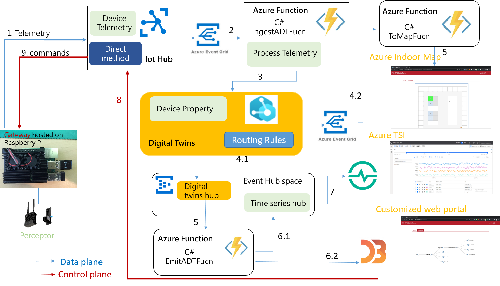

# Azure Digital Twins for Azure Percept

# Contents
- [Purpose](#purpose)
- [Cloud service used](#cloud-service-used)
- [Digital Twins Definition Language](#digital-twins-definition-language)
  - [Models](#models)
- [Sample project contents](#sample-project-contents)
- [How to use](#how-to-use)
  - [Prerequisites](#prerequisites)
  - [Project Repository](#clone)
  - [SOP for Initiating Services](#sop-for-initiating-services)
- [Dashboard](#dashboard)
- [Contributing](#contributing)
- [License](#license)

# Purpose
This project contains a sample for working with Azure Digital Twins:
* A building scenario sample written in Python, C# and Node.js. The sample can be used to set up and simulate a full end-to-end scenario with Azure Digital Twins
* The designed Flow and architecture is showed as following:


# Cloud service used
* [Azure Digital Twins](https://docs.microsoft.com/zh-tw/azure/digital-twins/overview)
* [Azure Function](https://docs.microsoft.com/zh-tw/azure/azure-functions/functions-overview)
* [Azure IoT Hub](https://docs.microsoft.com/zh-tw/azure/iot-hub/about-iot-hub)
* [Azure Event Hub](https://docs.microsoft.com/zh-tw/azure/event-hubs/event-hubs-about)
* [Azure Maps](https://docs.microsoft.com/zh-tw/azure/azure-maps/about-azure-maps)

# Digital Twins Definition Language
The Digital Twins Definition Language (DTDL) is a language for describing models and interfaces for IoT digital twins such as shipping containers, rooms, factory floors, or logical entities that participate in IoT solutions as well as describes a digital twin's device capabilities. The DTDL in this sample project describes the Percept's properties,status and relationship in a specific room,floor, building and location. The hierarchical relationship inside a DTDL model is defined as following 3 sections:  

### Models
* Floor
  * The following model example shows a digital twin of a floor that has a name property and a relationship to rooms contained in the building.
  * [Floor DTDL Model](./DTDL-Model/floor-v4.json) 

* Room
  * The following model example shows a digital twin of a room that has a name property and a relationship to rpcs contained in the room.
  * [Room DTDL Model](./DTDL-Model/room-v4.json) 

* Percept State
  * The Percept State model describes a Percept's device capabilities such as it's status(property) as well as the commands it can accept which can be used for remote monitoring and control .
  * [RPC DTDL Model](./DTDL-Model/peceptorStats-v1.json)

# Sample project contents
The sample repo contains:

| Folder | Description |
| --- | --- |
| DTDL-Model | Models for RPC Azure Digital Twins are defined using the Digital Twins Definition language (DTDL). |
| Front-End | This `Azure Digital Twins Viewer` serves as a front-end to the Azure Digital Twins spatial intelligence graph. It provides the following features:(1) Visualizing the relationship between floor, rooms and rpc devices created in the Azure Digital Twins model (2) Add and Delete Percept Devices (3) Viewing properties, telemetries and Commands of models (4) Viewing telemetry data of Percept Devices (5) Manage models (Upload and Delete) (6) Show rpc Devices location and status on the map (7) Set the threshold values from the dashboard for all Percepts |
| Back-End/Proxy | Setup a system assigned identity to allow proxy to access Azure Digital Twins Service. |
| Back-End/Azure-Functions | The Azure Functions receives the data from Azure IoT Hub and uses the DigitalTwins APIs to set properties and telemetry events on digital twins accordingly. |
| PnP-Device/Percept | Sample Source Code for Percept Device, which reports Status and receives Command to/from Azure Digital Twins through Azure IoT Hub. |
| Indoor-Map-Files | Azure Indoor Maps will need to be uploaded as DWG files, which is AutoCAD's standard format. |

# How to use
### Prerequisites
 * Front-End & Back-End
   * Dashboard & Proxy
     * IDE & Tool
        * [Visual Studio Code](https://code.visualstudio.com/)
        * [Postman](https://www.postman.com/)
     * Package and Language Version
        * [npm](https://www.npmjs.com/get-npm)
        * [Node.js v10.16.0](https://nodejs.org/en/download/)
        * [vue v2.6.12](https://vuejs.org/)
   * Azure Funciton
     * IDE
        * Visual Studio 2019 C#
     * Library
        * Azure.Core v1.6.0
        * Azure.DigitalTwins.Core v1.2.0
        * Azure.Identity v1.3.0
        * Microsoft.Net.Sdk.Funtions v3.0.7
        * System.Net.Http  v4.3.4
* Plug and Play Device ( PnP Device )
  * Python 3.7
     * azure-core 1.9.0
     * azure-eventhub 5.2.0
     * azure-iot-device 2.4.0
     * azure-iot-hub 2.2.3
     * async-timeout 3.0.1
     * cryptography 3.3.1

### Clone
* Clone this repository to your local machine
  ```
  $ git clone https://github.com/ArcherHuang/Examples-of-Azure-Digital-Twins.git
  $ cd Examples-of-Azure-Digital-Twins
  $ git branch -a
  $ git checkout -t origin/Azure-Percept
  $ git branch
  ```
  
### SOP for Initiating Services
* [Step-By-Step Instructions](./Doc/SOP-for-Initiating-Services.md)

# Contributing
* [Huang, Cheng-Chuan](https://github.com/ArcherHuang)
* [Lin, Hung-Wei](https://github.com/levanlin)

# License
Azure Digital Twins for Azure Percepte is licensed under the [MIT](./LICENSE) license.
