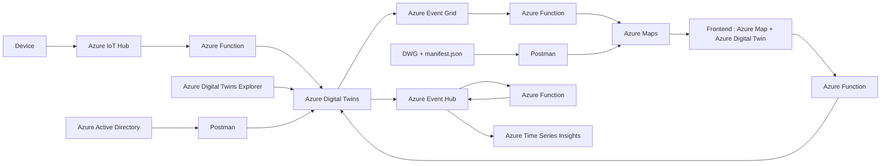

# Azure Digital Twins & Azure Indoor Map

## Contents
- [Purpose](#purpose)
- [Cloud service used](#cloud-service-used)
- [Digital Twins Definition Language](#digital-twins-definition-language)
  - [Models](#dtdl-models)
- [How to use](#how-to-use)
  - [Prerequisites](#prerequisites)
  - [Operations Manual](#operations-manual)
- [Contributor](#contributor)
- [License](#license)

## Purpose
This project contains a sample for working with Azure Digital Twins:

* A building scenario sample written in Node.js and Vue. The sample can be used to set up and simulate a full end-to-end scenario with Azure Digital Twins.
* The designed Flow and architecture is showed as following:

## Cloud service used
* [Azure Digital Twins](https://docs.microsoft.com/zh-tw/azure/digital-twins/overview)
* [Azure Digital Twins Explorer](https://docs.microsoft.com/en-us/samples/azure-samples/digital-twins-explorer/digital-twins-explorer/)
* [Azure Function](https://docs.microsoft.com/zh-tw/azure/azure-functions/functions-overview)
* [Azure IoT Hub](https://docs.microsoft.com/zh-tw/azure/iot-hub/about-iot-hub)
* [Azure Event Hub](https://docs.microsoft.com/zh-tw/azure/event-hubs/event-hubs-about)
* [Azure Maps](https://docs.microsoft.com/zh-tw/azure/azure-maps/about-azure-maps)
* [Azure Event Grid](https://docs.microsoft.com/en-us/azure/event-grid/)
* [Azure Active Directory](https://docs.microsoft.com/en-us/azure/active-directory/fundamentals/)

## Digital Twins Definition Language
The Digital Twins Definition Language (DTDL) is a language for describing models and interfaces for IoT digital twins such as shipping containers, rooms, factory floors, or logical entities that participate in IoT solutions as well as describes a digital twin's device capabilities. The DTDL in this sample project describes the properties and relationship in a specific device. The DTDL model is defined as following 3 sections:  

### DTDL Models
* [R2R](./DTDL/R2R.json) 
* [升降台](./DTDL/升降台.json) 
* [裁切馬達](./DTDL/裁切馬達.json)

## How to use
### Prerequisites
* Front-End & Back-End
  * Dashboard
    * IDE & Tool
      * [Visual Studio Code](https://code.visualstudio.com/)
      * [Postman](https://www.postman.com/)
    * Package and Language Version
      * [npm](https://www.npmjs.com/get-npm)
      * [Node.js v14](https://nodejs.org/en/download/)
      * [vue v2.6.12](https://vuejs.org/)
  * Azure Funciton
    * Node.js v14
      * [@azure/identity: ^2.0.4](https://www.npmjs.com/package/@azure/identity)
      * [axios: ^0.26.0](https://www.npmjs.com/package/axios)
      * [dotenv: ^16.0.0](https://www.npmjs.com/package/dotenv)
* Device
  * Node.js v14
     * [azure-iot-device: ^1.17.8](https://www.npmjs.com/package/azure-iot-device)
     * [azure-iot-device-mqtt: ^1.15.8](https://www.npmjs.com/package/azure-iot-device-mqtt)
     * [dotenv: ^16.0.0](https://www.npmjs.com/package/dotenv)

## Operations Manual
* [Manual](./Docs/Manual.md)

## Contributor
* [Huang, Cheng-Chuan](https://github.com/ArcherHuang)

## License
Azure Digital Twins for Sample is licensed under the [MIT](./LICENSE) license.