# Azure Digital Twins for Remote Particle Counter ( RPC )

# Contents
- [Purpose](#purpose)
- [Cloud service used](#cloud-service-used)
- [Digital Twins Definition Language](#digital-twins-definition-language)
  - [Models](#models)
- [Sample project contents](#sample-project-contents)
- [How to use](#how-to-use)
  - [Prerequisites](#prerequisites)
  - [Project Repository](#clone)
  - [SOP for Initiating Services](#sop-for-initiating-services)
  - [Setup App](#setup-app)
- [Dashboard](#dashboard)
- [Contributing](#contributing)
- [License](#license)

# Purpose
This project contains a sample for working with Azure Digital Twins:
* A building scenario sample written in Python, C# and Node.js. The sample can be used to set up and simulate a full end-to-end scenario with Azure Digital Twins
* The designed Flow and architecture is showed as following:


# Cloud service used
* [Azure Digital Twins](https://docs.microsoft.com/zh-tw/azure/digital-twins/overview)
* [Azure Function](https://docs.microsoft.com/zh-tw/azure/azure-functions/functions-overview)
* [Azure IoT Hub](https://docs.microsoft.com/zh-tw/azure/iot-hub/about-iot-hub)
* [Azure Event Hub](https://docs.microsoft.com/zh-tw/azure/event-hubs/event-hubs-about)
* [Azure Maps](https://docs.microsoft.com/zh-tw/azure/azure-maps/about-azure-maps)

# Digital Twins Definition Language
The Digital Twins Definition Language (DTDL) is a language for describing models and interfaces for IoT digital twins such as shipping containers, rooms, factory floors, or logical entities that participate in IoT solutions as well as describes a digital twin's device capabilities. The DTDL in this sample project describes the Remote Particle Counter's properties,status and relationship in a specific room,floor, building and location. The hierarchical relationship inside a DTDL model is defined as following 3 sections:  

### Models
* Floor
  * The following model example shows a digital twin of a floor that has a name property and a relationship to rooms contained in the building.
  * [Floor DTDL Model](./DTDL-Model/floor-v3.json) 

* Room
  * The following model example shows a digital twin of a room that has a name property and a relationship to rpcs contained in the room.
  * [Room DTDL Model](./DTDL-Model/room-v3.json) 

* Remote Particle Counter(RPC) State
  * The RPC State model describes a Remote Particle Counter's device capabilities such as it's status(property) as well as the commands it can accept which can be used for remote monitoring and control .
  * [RPC DTDL Model](./DTDL-Model/rpcStats-v9.json)

# Sample project contents
The sample repo contains:

| Folder | Description |
| --- | --- |
| DTDL-Model | Models for RPC Azure Digital Twins are defined using the Digital Twins Definition language (DTDL). |
| Front-End | This `Azure Digital Twins Viewer` serves as a front-end to the Azure Digital Twins spatial intelligence graph. It provides the following features:(1) Visualizing the relationship between floor, rooms and rpc devices created in the Azure Digital Twins model (2) Add and Delete rpc Devices (3) Viewing properties, telemetries and Commands of models (4) Viewing telemetry data of rpc Devices (5) Manage models (Upload and Delete) (6) Show rpc Devices location and status on the map (7) Set the threshold values from the dashboard for all rpcs |
| Back-End/Proxy | Setup a system assigned identity to allow proxy to access Azure Digital Twins Service. |
| Back-End/Azure-Functions | The Azure Functions receives the data from Azure IoT Hub and uses the DigitalTwins APIs to set properties and telemetry events on digital twins accordingly. |
| PnP-Device/rpc | Sample Source Code for Remote Particle Counter Device, which reports Status and receives Command to/from Azure Digital Twins through Azure IoT Hub. |
| Indoor-Map-Files | Azure Indoor Maps will need to be uploaded as DWG files, which is AutoCAD's standard format. |

# How to use
### Prerequisites
 * Front-End & Back-End
   * Dashboard & Proxy
     * IDE & Tool
        * [Visual Studio Code](https://code.visualstudio.com/)
        * [Postman](https://www.postman.com/)
     * Package and Language Version
        * [npm](https://www.npmjs.com/get-npm)
        * [Node.js v10.16.0](https://nodejs.org/en/download/)
        * [vue v2.6.12](https://vuejs.org/)
   * Azure Funciton
     * IDE
        * Visual Studio 2019 C#
     * Library
        * Azure.Core v1.6.0
        * Azure.DigitalTwins.Core v1.2.0
        * Azure.Identity v1.3.0
        * Microsoft.Net.Sdk.Funtions v3.0.7
        * System.Net.Http  v4.3.4
* Plug and Play Device ( PnP Device )
  * Python 3.7
     * azure-core 1.9.0
     * azure-eventhub 5.2.0
     * azure-iot-device 2.4.0
     * azure-iot-hub 2.2.3
     * async-timeout 3.0.1
     * cryptography 3.3.1

### Clone
* Clone this repository to your local machine
  ```
  $ git clone https://github.com/ArcherHuang/Azure-Digital-Twins-for-RPC.git
  ```
  
### SOP for Initiating Services
1. Start Azure Digital Twins Service by setting Endpoint
   - Ref [Manage ADT endpoints](https://docs.microsoft.com/en-us/azure/digital-twins/how-to-manage-routes-portal)
   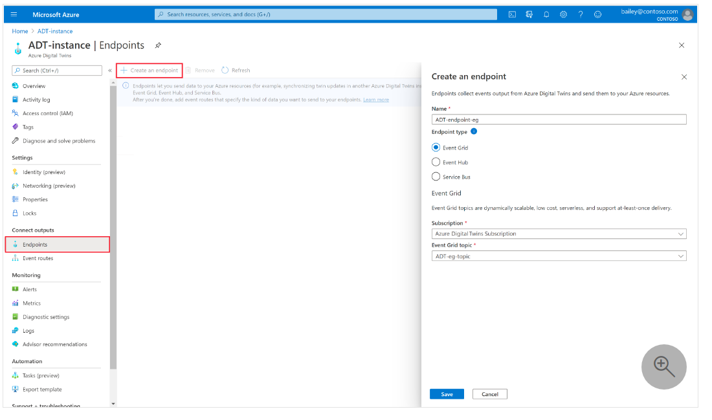
2. Setup IoT Hub Message Routing to **`IngestADTFunctions`** Endpoint
   - Ref【 [Setup Azure Event Hubs & Azure Functions](#setup-azure-event-hubs--azure-functions) 】➙【 Source Code 】Section
   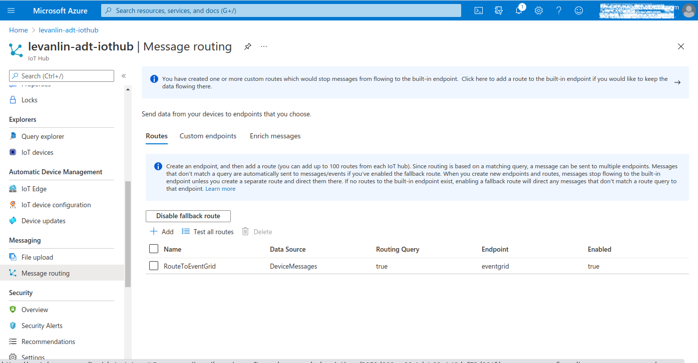
3. Deploy & Start **`IngestADTFunctions`** Azure Function
   - Environment Variable
     - ADT_SERVICE_URL
       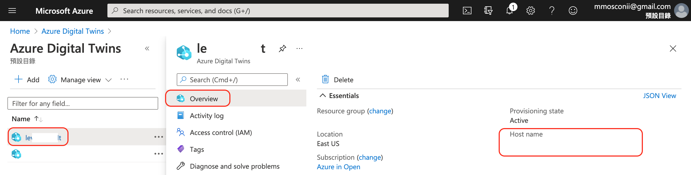
   - Ref [Deploy Azure Fucntions](https://docs.microsoft.com/en-us/azure/azure-functions/functions-develop-vs)
   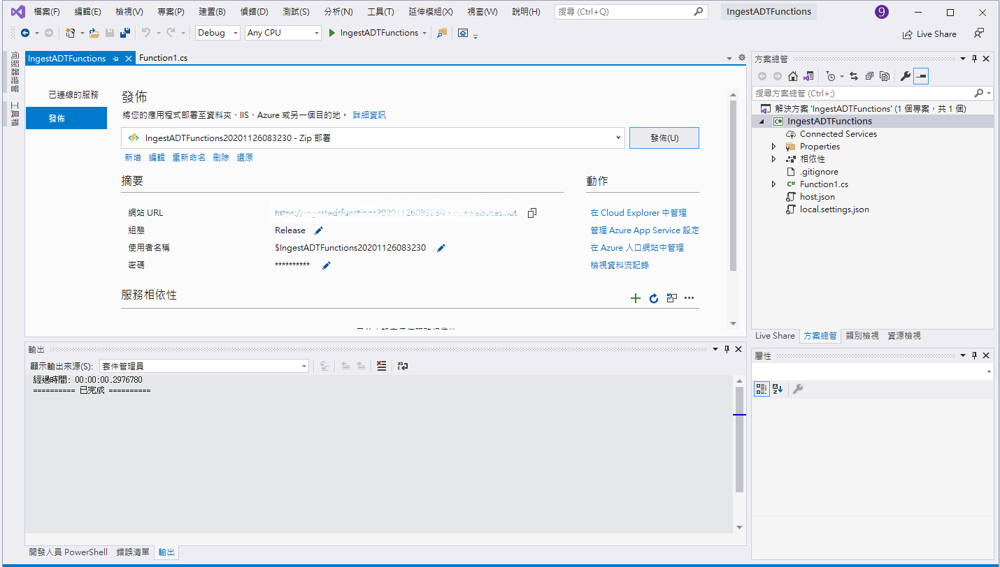
4. Deploy & Start **`EmitAdtTsi`** Azure Function
   - Ref [Deploy Azure Fucntions as step 3](https://docs.microsoft.com/en-us/azure/azure-functions/functions-develop-vs)
5. Azure Maps service setup and indoor map import
   - Azure Maps
     - Create Azure Maps Account
       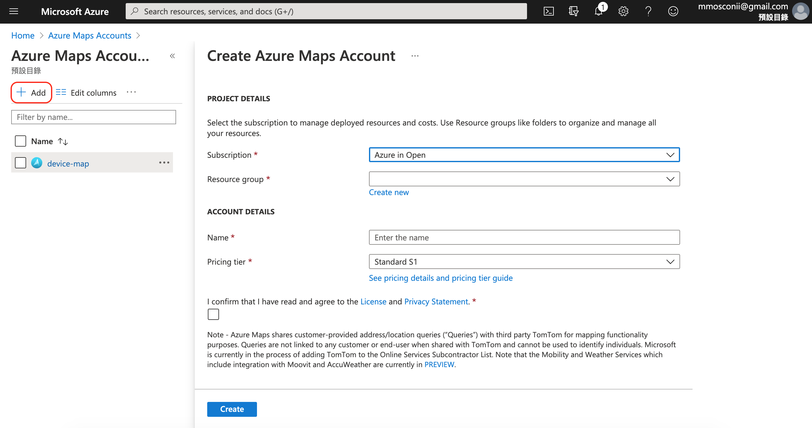
     - Add ./Azure-Digital-Twins-for-RPC/Front-End/.env content ( Latitude and Longitude of company )
       - VUE_APP_LONGITUDE
       - VUE_APP_LATITUDE
   - Azure Indoor Maps
     - Add DWG and manifest.json to Azure Indoor Maps
       - Ref [Use Creator to create indoor maps](https://docs.microsoft.com/zh-tw/azure/azure-maps/tutorial-creator-indoor-maps)
     - Add ./Azure-Digital-Twins-for-RPC/Front-End/.env content
       - VUE_APP_MAP_SUBSCRIPTION_KEY
         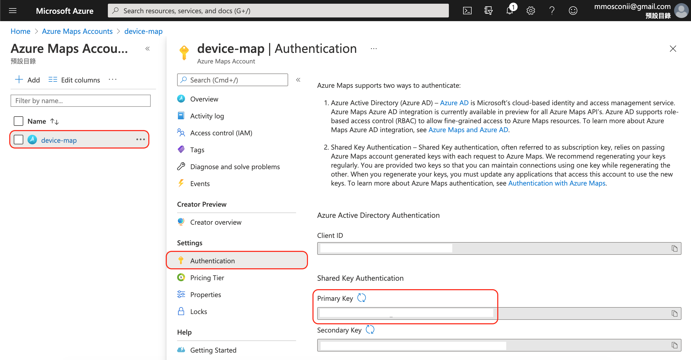
       - VUE_APP_MAP_TILESETID
         - Ref [Create a tileset
  ](https://docs.microsoft.com/zh-tw/azure/azure-maps/tutorial-creator-indoor-maps#create-a-tileset)
           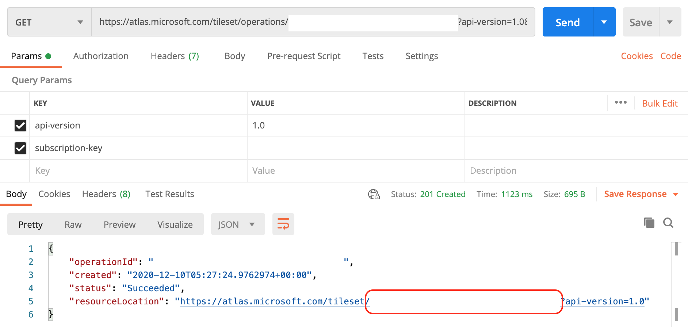
       - VUE_APP_MAP_STATESETID
         - Ref [Create a feature stateset](https://docs.microsoft.com/zh-tw/azure/azure-maps/tutorial-creator-indoor-maps#create-a-feature-stateset)
           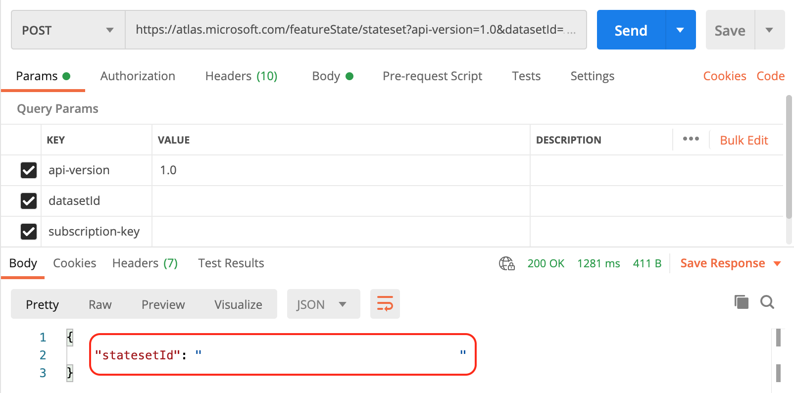
6. Deploy & Start **`toMap`** Azure Function
   - Environment Variable
     - statesetID
       
     - subscription-key
       
   - Ref [Deploy Azure Fucntions as step 3](https://docs.microsoft.com/en-us/azure/azure-functions/functions-develop-vs)
7. Add ./Azure-Digital-Twins-for-RPC/Front-End/.env content
   - VUE_APP_IOT_HUB_ENDPOINT
     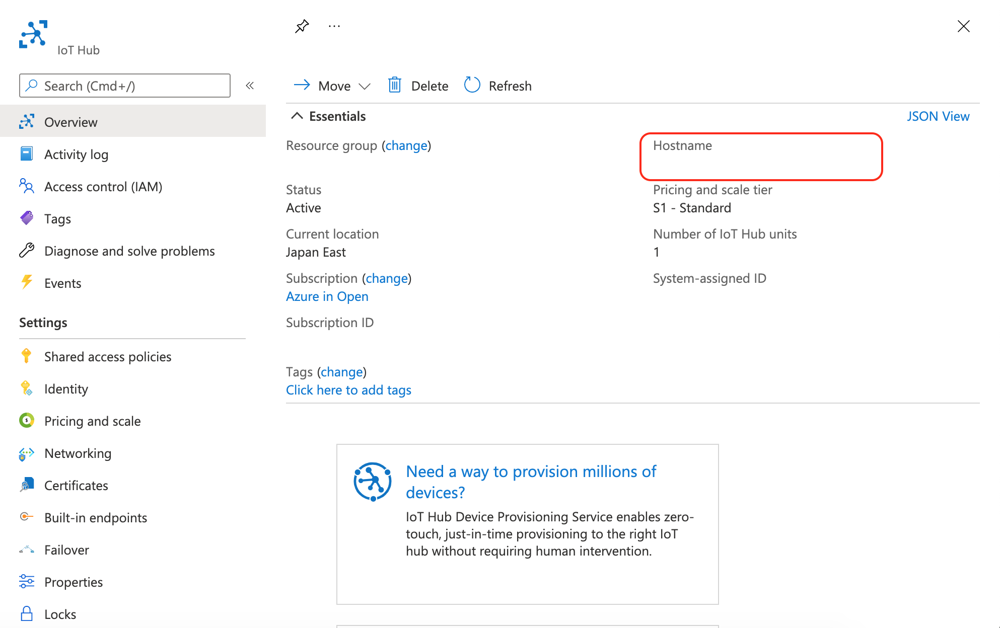
   - VUE_APP_IOT_HUB_DEVICEKEY & VUE_APP_IOT_HUB_POLICYNAME
     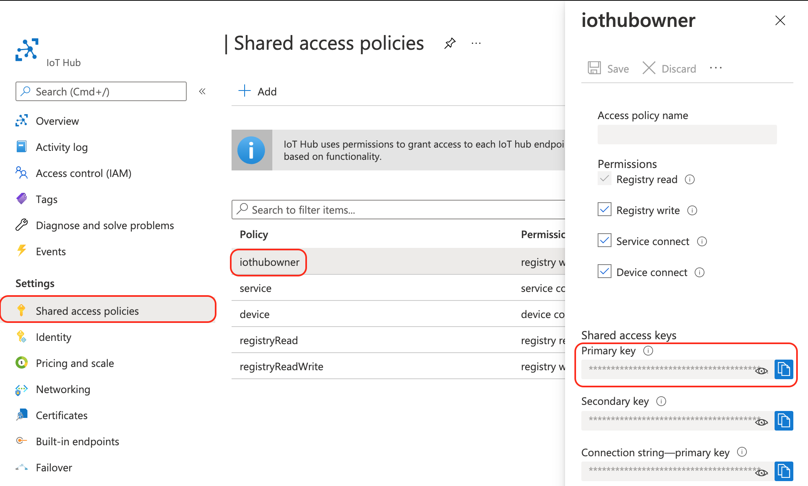
   - VUE_APP_EVENT_HUB_NAME
     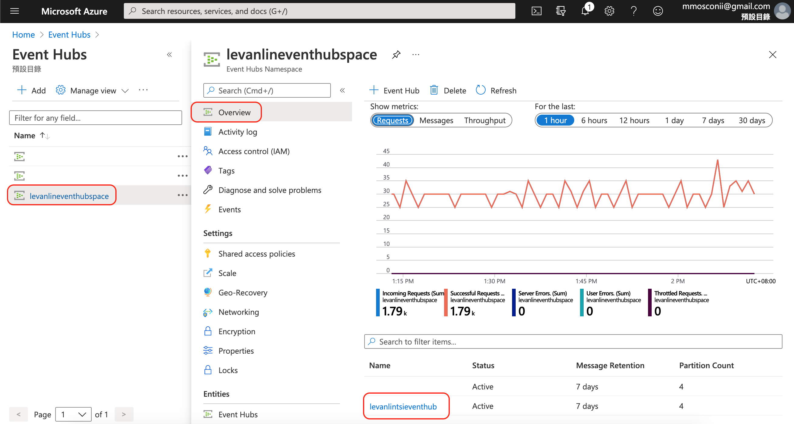
   - VUE_APP_EVENT_HUB_CONNECTIONSTRING
     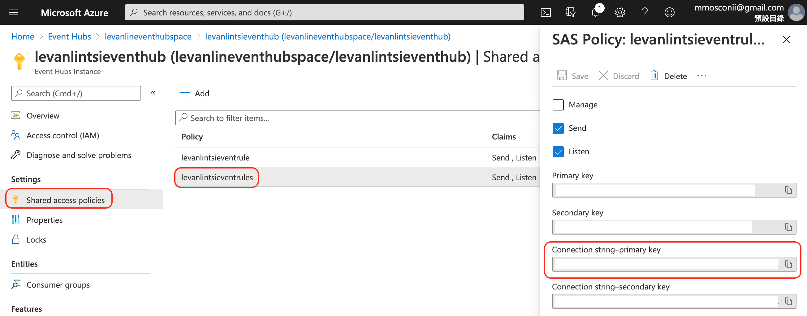
8. Add ./Azure-Digital-Twins-for-RPC/Back-End/Proxy/.env content
   - AZURE_DIGITAL_TWINS_HOST_NAME=https://
     
9. Run & Check server
   - Proxy Server
     - Ref【 [Proxy](#proxy) 】Section
   - Dashboard Server
     - Ref【 [Dashboard](#dashboard) 】Section
10. Run & Go to your TSI Explorer
   - Ref [Time Series Insight](https://docs.microsoft.com/en-us/azure/time-series-insights/)
     
11. Start Device by running rpc_pnp.py
   - PnP Device
     - Ref【 [RPC Device Client](#rpc-device-client) 】➙【 PnP Device 】Section

### Setup App
#### Setup Azure Event Hubs & Azure Functions
  * Azure Functions Source Code
    * [EmitAdtTsi](https://github.com/ArcherHuang/Azure-Digital-Twins-for-RPC/tree/main/Back-End/Azure-Functions/EmitAdtTsi)
    * [IngestADTFunctions](https://github.com/ArcherHuang/Azure-Digital-Twins-for-RPC/tree/main/Back-End/Azure-Functions/IngestADTFunctions)
    * [toMap](https://github.com/ArcherHuang/Azure-Digital-Twins-for-RPC/tree/main/Back-End/Azure-Functions/toMap)
  * Documentation
    * [EventHub](https://docs.microsoft.com/en-us/azure/digital-twins/how-to-integrate-time-series-insights)
    * [EventGrid](https://docs.microsoft.com/en-us/azure/digital-twins/how-to-create-azure-function?tabs=cli)
    * [IoT Hub direct method](https://docs.microsoft.com/en-us/azure/iot-hub/iot-hub-devguide-direct-methods#:~:text=IoT%20Hub%20gives%20you%20the,a%20user%2Dspecified%20timeout)
    * [Deploy Azure Fucntions](https://docs.microsoft.com/en-us/azure/azure-functions/functions-develop-vs)
    * [New application setting](https://docs.microsoft.com/zh-tw/azure/azure-functions/functions-how-to-use-azure-function-app-settings?tabs=portal)
    
#### Proxy
  * **1. Enter the project folder**
    ```
    $ cd ./Azure-Digital-Twins-for-RPC/Back-End/Proxy
    ```
  * **2. Install packages via npm**
    ```
    $ npm install
    ```
  * **3. Create .env file**
    ```
    $ touch .env
    ```
  * **4. Store Key in .env file and save**
    ```
    AZURE_DIGITAL_TWINS_HOST_NAME=
    ```
  * **5. Activate the server**
    ```
    $ node index.js
    ```
  * **6. Find the message for successful activation**
    ```
    [HPM] Proxy created: /  -> https://levanlin-adt.api.eus.digitaltwins.azure.net
    Example app listening on port 3000!
    ```
    
#### Dashboard
  * **1. Enter the project folder**
    ```
    $ cd ./Azure-Digital-Twins-for-RPC/Front-End
    ```
  * **2. Install packages via npm**
    ```
    $ npm install
    ```
  * **3. Create .env file**
    ```
    $ touch .env
    ```
  * **4. Store Key in .env file and save**
    ```
    VUE_APP_MAP_SUBSCRIPTION_KEY=
    VUE_APP_MAP_TILESETID=
    VUE_APP_MAP_STATESETID=
    VUE_APP_LONGITUDE=
    VUE_APP_LATITUDE=
    VUE_APP_COMPANY_NAME=
    VUE_APP_EVENT_HUB_CONNECTIONSTRING=
    VUE_APP_EVENT_HUB_NAME=
    VUE_APP_IOT_HUB_ENDPOINT=
    VUE_APP_IOT_HUB_DEVICEKEY=
    VUE_APP_IOT_HUB_POLICYNAME=
    ```
  * **5. Activate the server**
    ```
    $ npm run serve
    ```
  * **6. Find the message for successful activation**
    ```
    App running at:
    - Local:   http://localhost:8081/ 
    - Network: http://172.20.10.2:8081/

    Note that the development build is not optimized.
    To create a production build, run npm run build.
    ```
    You may start using the dashboard by accessing: http://localhost:8081/

#### RPC Device Client 
  * PnP Device
    * **1. Enter the project folder**
      ```
      $ cd ./Azure-Digital-Twins-for-RPC/PnP-Device/rpc
      ```
    * **2. Change values in rpc_pnp.py**
      * Device ID
        ```
        rpc_component_name_01 = 'here-your-rpc-id01'
        ```
      * IoT Hub connection string
        ```
        IOTHUB_DEVICE_CONNECTION_STRING_DEV="HostName=here-your-azure-iothub.net;SharedAccessKeyName=iothubowner;SharedAccessKey=your-device-key01"
        ```
        * Get Primary Connection String
          * Get Device ID
            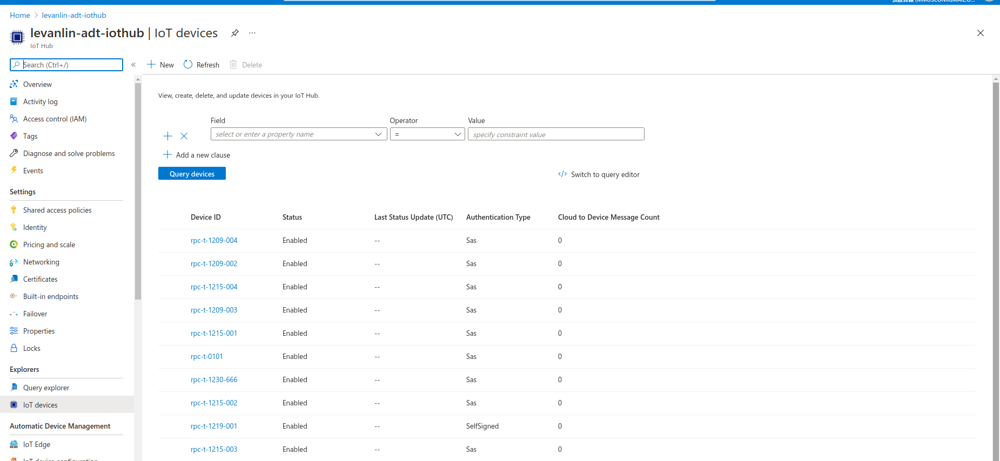
          * Get Primary Connection String
            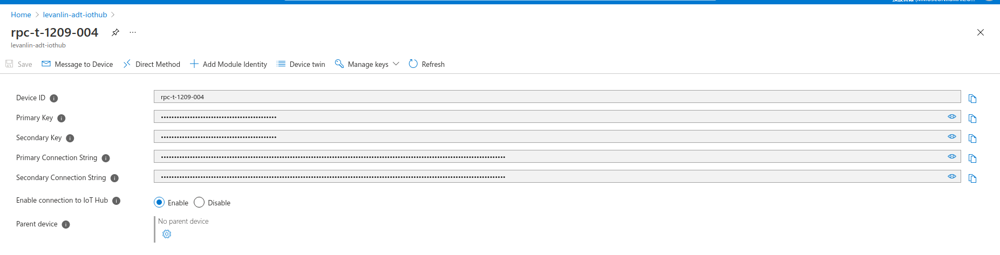

    * **3. Run Python**
      ```
      $ python3 rpc_pnp.py
      ```
  * Ref
     * [Azure-IoT-Device SDK](https://github.com/Azure/azure-iot-sdk-python)
     
# Dashboard
* DTDL List


* View DTDL


* Outdoor Map


* Indoor Map


* Tree Graph


# Contributing
* [Lin, Hung-Wei](https://github.com/levanlin)
* [Huang, Cheng-Chuan](https://github.com/ArcherHuang)

# License
Azure Digital Twins for Remote Particle Counter is licensed under the [MIT](./LICENSE) license.
