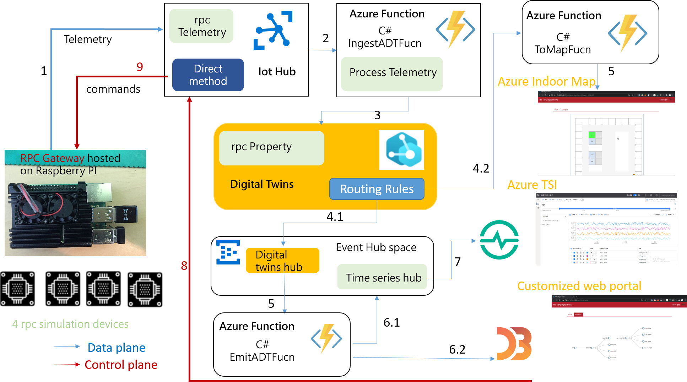

# Azure Digital Twins for Remote Particle Counter(RPC)

# Purpose
This project contains a sample for working with Azure Digital Twins:
* A building scenario sample written in Python, C# and Node.js. The sample can be used to set up and simulate a full end-to-end scenario with Azure Digital Twins
* The desiged Flow and architecture is showed as following:


# Cloud service used
* [Azure Digital Twins](https://docs.microsoft.com/zh-tw/azure/digital-twins/overview)
* [Azure Function](https://docs.microsoft.com/zh-tw/azure/azure-functions/functions-overview)
* [Azure IoT Hub](https://docs.microsoft.com/zh-tw/azure/iot-hub/about-iot-hub)
* [Azure Event Hub](https://docs.microsoft.com/zh-tw/azure/event-hubs/event-hubs-about)
* [Azure Maps](https://docs.microsoft.com/zh-tw/azure/azure-maps/about-azure-maps)

# Digital Twins Definition Language
The Digital Twins Definition Language (DTDL) is a language for describing models and interfaces for IoT digital twins such as shipping containers, rooms, factory floors, or logical entities that participate in IoT solutions as well as describes a digital twin's device capabilities. The DTDL in this sample project describes the Remote Particle Counter's properties,status and relationship in a specific room,floor, building and location. The hierarchical relationship inside a DTDL model is defined as following 3 sections:  

### Models
* Floor
  * The following model example shows a digital twin of a floor that has a name property and a relationship to rooms contained in the building.
 
```
{
  "@id": "dtmi:itri:cms:Floor;3",
  "@type": "Interface",
  "displayName": "Floor Interface Model",
  "@context": "dtmi:dtdl:context;2",
  "contents": [
    {
      "name": "floorName",
      "@type": "Property",
      "displayName": "Floor's Name",
      "description": "Floor's Name",
      "schema": "string"
    },
    {
      "@type": "Relationship",
      "name": "rooms",
      "target": "dtmi:itri:cms:Room;3"
    }
  ]
}
```

* Room
  * The following model example shows a digital twin of a room that has a name property and a relationship to rpcs contained in the room.
```
{
  "@id": "dtmi:itri:cms:Room;4",
  "@type": "Interface",
  "displayName": "Room Interface Model",
  "@context": "dtmi:dtdl:context;2",
  "contents": [
    {
      "name": "roomName",
      "@type": "Property",
      "displayName": "Room's Name",
      "description": "Room's Name",
      "schema": "string"
    },
    {
      "@type": "Relationship",
      "name": "rpcs",
      "target": "dtmi:itri:cms:RPCstat;9"
    }
  ]
}
```

* Remot Particle Counter(RPC) State
  * The RPC State model describes a Remote Particle Counter's device capabilities such as it's status(property) as well as the commands it can accept which can be used for remote monitoring and control .
```
{
  "@context": [
    "dtmi:dtdl:context;2"
  ],
  "@id": "dtmi:itri:cms:RPCstat;9",
  "@type": "Interface",
  "displayName": "RPC STATS 9",
  "description": "Reports current RPC and provides desired RPC threshole control.",
  "contents": [
    {
      "@type": "Property",
      "name": "threshole5um",
      "displayName": "Particle size 5 um",
      "description": "RPC Particle Size reach counts.",
      "schema": "long"
    },
    {
      "@type": "Property",
      "name": "particle5um",
      "schema": "long",
      "displayName": "Set 5 um Target RPC Threshole",
      "description": "remote set alarm when target RPC reach limit counts."
    },
    {
      "@type": "Property",
      "name": "threshole3um",
      "displayName": "Particle size 3 um",
      "description": "RPC Particle Size reach Counts.",
      "schema": "long"
    },
    {
      "@type": "Property",
      "name": "particle3um",
      "schema": "long",
      "displayName": "Set 3 um Target RPC Threshole",
      "description": "remote set alarm when target RPC reach limit counts."
    },
    {
      "@type": "Property",
      "name": "threshole1um",
      "displayName": "Particle size 1 um",
      "description": "RPC Particle Size reach Counts.",
      "schema": "long"
    },
    {
      "@type": "Property",
      "name": "particle1um",
      "schema": "long",
      "displayName": "Set 1 um Target RPC Threshole",
      "description": "remote set alarm when target RPC reach limit counts."
    },
    {
      "@type": "Property",
      "name": "threshole05um",
      "displayName": "Particle size 0.5 um",
      "description": "RPC Particle Size reach Counts.",
      "schema": "long"
    },
    {
      "@type": "Property",
      "name": "particle05um",
      "schema": "long",
      "displayName": "Set 0.5 um Target RPC Threshole",
      "description": "remote set alarm when target RPC reach limit counts."
    },
    {
      "@type": "Property",
      "name": "rpcAlarm",
      "schema": "integer",
      "displayName": "RPC over threshole",
      "description": "Turn On/off alarm when any of 4 RPC particle sensor reach threshole"
    },
    {
      "@type": "Property",
      "name": "featureId",
      "schema": "integer",
      "displayName": "Room ID",
      "description": "room where RPC is allocated"
    },
    {
      "@type": "Command",
      "name": "settimetowatch",
      "displayName": "Set RPC WatchTime",
      "description": "Remote Set RPC sampling Frequence default 715."
    },
    {
      "@type": "Command",
      "name": "settimetosleep",
      "displayName": "Set RPC SleepTime",
      "description": "Remote Set RPC sampleing activatated interval Time."
    },
    {
      "@type": "Property",
      "name": "timetowatch",
      "schema": "integer",
      "displayName": "RPC WatchTime",
      "description": "Specify RPC sampling Frequence default 715."
    },
    {
      "@type": "Property",
      "name": "timetosleep",
      "schema": "integer",
      "displayName": "RPC SleepTime",
      "description": "Specifiy RPC sampling activated interval Time."
    },
    {
      "@type": "Property",
      "name": "timestamp",
      "schema": "long",
      "displayName": "telemetry delivery or receive time ",
      "description": "msg delivery or receive time"
    }

  ]
}
```
# Sample project contents
The sample repo contains:

| Folder | Description |
| --- | --- |
| DTDL-Model | Models for RPC Azure Digital Twins are defined using the Digital Twins Definition language (DTDL). |
| Front-End | This `Azure Digital Twins Viewer` serves as a front-end to the Azure Digital Twins spatial intelligence graph. It provides the following features:(1) Visualizing the relationship between floor, rooms and rpc devices created in the Azure Digital Twins model (2) Add and Delete rpc Devices (3) Viewing properties, telemetries and Commands of models (4) Viewing telemetry data of rpc Devices (5) Manage models (Upload and Delete) (6) Show rpc Devices location and status on the map (7) Set the threshold values from the dashboard for all rpcs |
| Back-End/Proxy | Setup a system assigned identity to allow proxy to access Azure Digital Twins Service. |

# How to use
The following instructions will get you a copy of the project and the setting needed to run the back-end server on your local machine.

### Prerequisites

- [npm](https://www.npmjs.com/get-npm)
- [Node.js v10.16.0](https://nodejs.org/en/download/)
- [vue v2.6.12](https://vuejs.org/)

### Clone
* Clone this repository to your local machine
  ```
  $ git clone https://github.com/ArcherHuang/Azure-Digital-Twins-for-RPC.git
  ```
### Setup App
* Proxy
  * **1. Enter the project folder**
    ```
    $ cd ./Back-End/Proxy
    ```
  * **2. Install packages via npm**
    ```
    $ npm install
    ```
  * **3. Create .env file**
    ```
    $ touch .env
    ```
  * **4. Store Key in .env file and save**
    ```
    AZURE_DIGITAL_TWINS_HOST_NAME=
    ```
  * **5. Activate the server**
    ```
    $ node index.js
    ```
  * **6. Find the message for successful activation**
    ```
    [HPM] Proxy created: /  -> https://levanlin-adt.api.eus.digitaltwins.azure.net
    Example app listening on port 3000!
    ```

* Dashboard
  * **1. Enter the project folder**
    ```
    $ cd ./Front-End/View
    ```
  * **2. Install packages via npm**
    ```
    $ npm install
    ```
  * **3. Create .env file**
    ```
    $ touch .env
    ```
  * **4. Store Key in .env file and save**
    ```
    VUE_APP_MAP_SUBSCRIPTION_KEY=
    VUE_APP_MAP_TILESETID=
    VUE_APP_MAP_STATESETID=
    VUE_APP_LONGITUDE=
    VUE_APP_LATITUDE=
    VUE_APP_COMPANY_NAME=
    VUE_APP_EVENT_HUB_CONNECTIONSTRING=
    VUE_APP_EVENT_HUB_NAME=
    VUE_APP_IOT_HUB_ENDPOINT=
    VUE_APP_IOT_HUB_DEVICEKEY=
    VUE_APP_IOT_HUB_POLICYNAME=
    ```
  * **5. Activate the server**
    ```
    $ npm run serve
    ```
  * **6. Find the message for successful activation**
    ```
    App running at:
    - Local:   http://localhost:8081/ 
    - Network: http://172.20.10.2:8081/

    Note that the development build is not optimized.
    To create a production build, run npm run build.
    ```
    You may start using the dashboard by accessing: http://localhost:8081/

# Dashboard
* DTDL List


* View DTDL


* Outdoor-Map


* Indoor-Map


* Tree-Graph


# Contributing
* [Lin, Hung-Wei]()
* [Huang, Cheng-Chuan](https://github.com/ArcherHuang)
